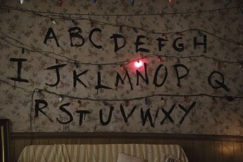

# StrangerThingsWall
Raspberry Pi project to spell out words with lights on an alphabet wall.

Given twitter app details for a twitter account, the program can pull @mentions of the account. It will then run these through a few test (only letters, nothing on blacklist included, has one of the supplied hashtags) and can the display a tweeted message as well.

Inspired by the wall from the Stranger Things TV Show.

Used in the very popular [Strangest Things Club Tour!](https://twitter.com/StrangestClub)

